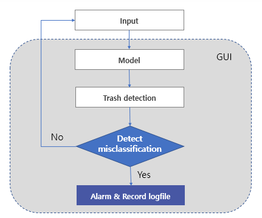
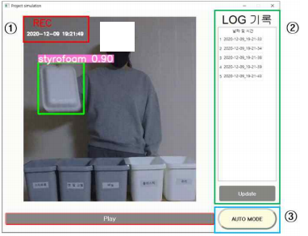
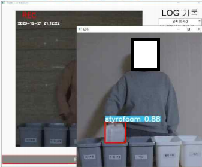
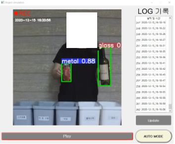
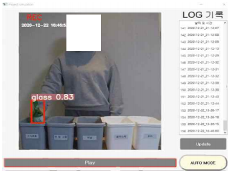
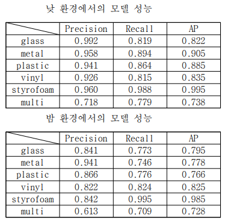

# Trash recycle project
Deeplearning project  
e-mail address : jinwoong.it@gmail.com  

## Introduction
- 딥러닝 Object-detection을 이용한 쓰레기 오분류 탐지 시스템  
- 쓰레기를 실시간으로 탐지한다.  
- 쓰레기가 잘못 분류되었을 시, 소리 알람과 화면을 캡처한다.  
- 어두운 환경에서도 화면이 잘 보일 수 있도록 밝기를 조절한다.  
- 환경부에서 배포한 '재활용품 분리배출 가이드라인'을 기준으로 분류한다.  
- 쓰레기를 손으로 집어서 버리는 것을 기본으로 한다.  
- GUI를 통해 밝기 조정, 로그 기록 클릭 시 캡처 화면 확인가능  
## Main Technology
- Object detection([Yolov5](https://github.com/ultralytics/yolov5))  
- Data augmentation  
- OPENCV  
- Data labeling([labelImg](https://github.com/tzutalin/labelImg))  
## Development Environment
- Pytorch  
- Python  
- PYQT5  
## System Diagram
  

## Results
- GUI 구성  
1 : 현재 시각 표기  
2 : 로그 기록  
3 : 어두울 시 밝기 조절  

  

- 캡처 화면 확인  

  

- 실행 결과  

  

  

- 성능 수치  

  